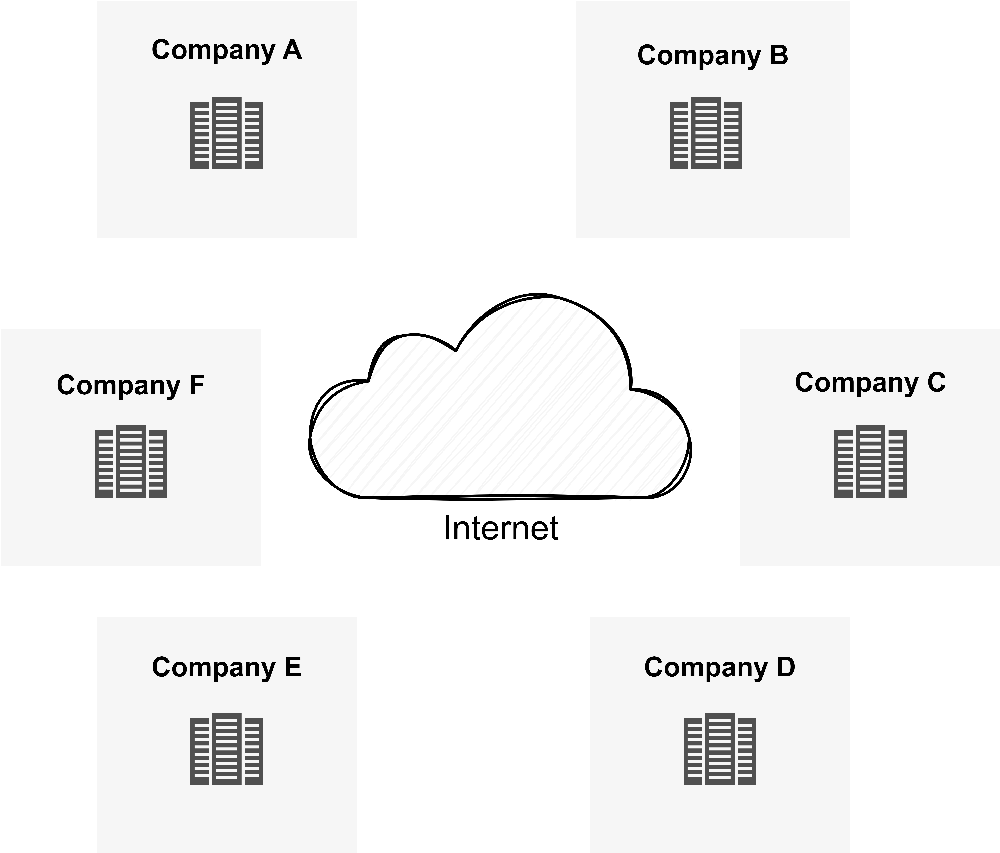
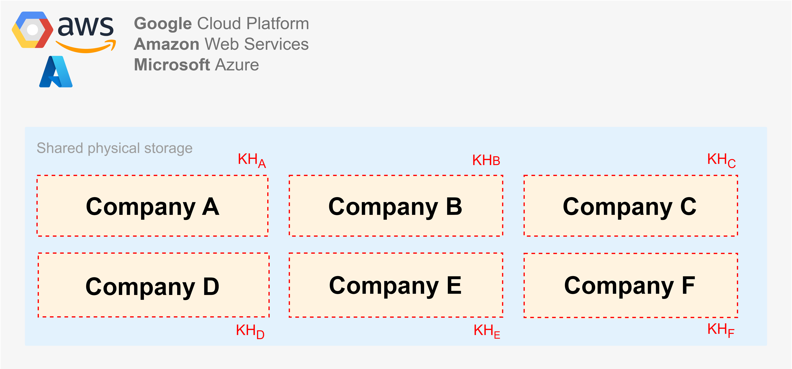

# Introduction
Welcome dear readers,
 
Because I've been working on data governance and cryptography quite a lot these days and part of data governance is data security, I've decided to write a short article on the topics of cloud HSM, BYOK and HYOK.
 
A short disclaimer, the article does not detail any cloud provider-specific implementation details and the contents is simplified for the sake of understanding by the general audience.

Additionally, the article uses a fictional company called **Kotatko LLC** in the worklows depicted in this article.

Enjoy the reading!

# The difference between physical HSM and cloud HSM
A physical HSM is a hardware appliance for storing cryptographic keys. A simple analogy is that HSM is a bigger and more expensive smart card.
 
A cloud HSM is a term encompassing the architecture, processes and components that provide cryptographic controls to cloud-native services. A simplified view of cloud HSM is that it is a service that consists of two core components,

- **Front-end**, a service (e.g., Azure Key Vault, GCP KMS or AWS KMS) that **Kotatko LLC** interacts with either through a graphical interface or programmatically through API
- **Back-end**, a solution (e.g., physical HSM or software keystore) for storing the cryptographic keys

Whether implementing **BYOK** or **HYOK**, the interaction between **Kotatko LLC** and the CSP always goes through the front-end API (e.g., Azure Key Vault, GCP KMS or AWS KMS).

# The basics of cryptographic key hierarchy
A cryptographic hierarchy refers to all the cryptographic keys used by a particular service or cryptographic solution and their logical relation to one another. In the context of a cryptographic key hierarchy the terms **KEK** (Key Encryption Key) and **DEK** (Data Encryption Key) describe the relation between two adjacent cryptographic keys (tiers).
 
As the names suggest the **KEK** is a cryptographic key that encrypts another key, while the **DEK** is a cryptographic key that encrypts data, unfortunately these names are misleading.
 
In the following example we have four cryptographic keys K1, K2, K3 and K4 creating a four-tier hierarchy protecting a cloud service such as,
 
- **Kotatko LLC** files protected by a data governance solution
- **Kotatko LLC** databases, data lakes and data warehouses
- **Kotatko LLC** mailboxes
- **Kotatko LLC**  backups
- **Kotatko LLC** compute resources
- **Kotatko LLC** assorted credentials and other cryptographic keys

The red and green arrows represent the order and direction of traversing the cryptographic key hierarchy to encrypt and decrypt the cloud service data. The orange dotted line represents the KEK and DEK relation between any two adjacent keys (tiers) as we traverse the cryptographic key hierarchy.
 
**Encrypting the cloud service data (red arrows)**
 
1.	The K4 encrypts the cloud service data.
2.	The K3 encrypts the K4.
3.	The K2 encrypts the K3
4.	The K1 encrypts the K2.
 
**Decrypting the cloud service data (green arrows)**
 
1.	The K1 decrypts the K2.
2.	The K2 decrypts the K3.
3.	The K3 decrypts the K4.
4.	The K4 decrypts the cloud service data.

There is no rule that says that the **DEK** can’t protect another key and in doing so take on the role of a **KEK**. Keep in mind that **DEK** and **KEK** are simply terms that represent a relation (one key protects the other key) between two adjacent keys (tiers). In theory you can have a key hierarchy with unlimited number of tiers, but every tier adds complexity and impacts performance. In the real world you typically have a two-tier hierarchy hence the two terms – **KEK** and **DEK**.
 
**Encrypting the cloud service data (red arrows)**

1.	The K2 (DEK) encrypts the cloud service data.
2.	The K1 (KEK) encrypts the K2.
 
**Decrypting the cloud service data (green arrows)**

1.	The K1 (KEK) decrypts the K2.
2.	The K2 decrypts the cloud service data.

A careful reader might notice that the **KEK** and **DEK** hierarchy resembles a chicken and an egg problem, if the **KEK** protects the **DEK**, who or what protects the **KEK**? That’s where the HSM comes in. The **KEK**, also called a **master key**, **root key** or **tenant key**, is stored (rooted) in the HSM and provided that the physical, administrative, and cryptographic controls of the HSM are “unbreakable” it is assumed that the **KEK** is secured and trusted. That’s why the HSM is also called the **root of trust**.

# The problem: Processing and storing data in the cloud
Before the emergence of cloud every company had a dedicated set of physical datacenters and each company stored and processed its data in their own datacenters. There was no situation in which a company would store and process their (strictly) confidential data or other intellectual property data in the same computational environment as their competitors.

Today majority of companies move increasingly more and more data (i.e., terabytes, petabytes), regardless of classification and sensitivity, to the cloud for storage and processing in a shared computation environment.

Because the data in the cloud is stored and processed in a shared computational environment and there is no physical separation between cloud tenants, the cloud providers separate cloud tenants and their data logically using cryptography more specifically every cloud tenant has a different cryptographic key hierarchy (i.e., KHA, KHB, KHC, KHD, KHE, KHF).

When it comes to cryptography the most important area is always cryptographic key management. What is relevant to the contents of this article are the answers to the following questions,
- How does **Kotatko LLC** create a cryptographic key?
- How does **Kotatko LLC** securely transport a cryptographic key from on-premises to the cloud?
- How does **Kotatko LLC** protect a cryptographic key on-premises and in the cloud?
 
That’s where **BYOK** and **HYOK** come in.

# The solution: Managing cryptographic keys in the cloud
Because there are several synonymous terms, let's clear them up first,
 
**BYOK** (Bring Your Own Key) = BYOE (Bring Your Own Encryption), key import 
**HYOK** (Hold Your Own Key) = EKM (External Key Manager), XKS (External Key Store)
 
To better understand the contents of the pictures in the following paragraphs let’s explain the most important terms.
 
**CSP** (Cloud Service Provider) – Microsoft Azure, GCP and AWS. 
**CKM** (Cryptographic Key Management) – A solution for managing the lifecycle of cryptographic keys. 
**KMS** (Key Management Service) – A CKM hosted and managed by the CSP (e.g., Azure Key Vault, GCP KMS and AWS KMS) 
**KEK** (Key Encryption Key) – A cryptographic key that protects (encrypts) the DEK. 
**DEK** (Data Encryption Key) – A cryptographic key that protects (encrypts) the data of the cloud service.
 
In the cloud there are two general options of managing cryptographic keys (there are more options, but let's keep it simple).
 
**Option 1** – The cryptographic keys are managed by the CSP, this is the option that typically contains the word “**default**” such as “encryption by **default**” or “key management by **default**”. With this option when **Kotatko LLC** provisions a cloud service they check a checkbox and all the operational overhead that comes with cryptography (e.g., creating keys, rotating keys, protecting keys, destroying keys, choosing algorithms and key sizes) is handled by the CSP on behalf of **Kotatko LLC**.

**Option 2** – To remain vendor neutral, let’s call it **CMK** (Customer-managed keys), requires **Kotatko LLC** to manage the cryptographic keys themselves using a cloud-native KMS.

Both **BYOK** and **HYOK** are a type of **CMK**. Let’s see what the differences are.

## BYOK (Bring Your Own Key)
In a **BYOK** scenario **Kotatko LLC** creates a cryptographic key (DEK) in a CKM that they control and then securely copy it to the CSP HSM via cloud KMS.
 
Because the main value of **BYOK** is the control over the key generation procedure which is typically done manually and recorded step-by-step for auditing or due dilligence purposes, it only makes sense to perform **BYOK** in a CKM in **Kotatko LLC** datacenter, but nowadays there are 3rd party vendors that provide a CKM as part of their “as a Service” portfolio and the **BYOK** procedure can be fully automated.
 
A simplified **BYOK** workflow is as follows, when **Kotatko LLC** needs to “bring” (import) a cryptographic key (DEK) to the cloud, it requires a communication between the **Kotatko LLC** CKM on the left and the CSP KMS on the right,

When **Kotatko LLC** needs to work with a cloud service or provision a cloud service it requires a communication between CSP KMS and the cloud service. The imported cryptographic key (DEK) becomes a KEK for cryptographic key hierarchy of cloud services and the cloud services create individual DEK keys as they are provisioned. When the DEK is decrypted and used by the cloud service to decrypt the data, the cloud service caches the DEK in-memory for a specific time period (depending on the cloud service) or the DEK can be further protected by additional controls, such as confidential computing (e.g., Intel SGX, AMD SEV). **The KEK never leaves the CSP HSM**.

A summary of **BYOK**,
 
- The main value of **BYOK** is the control over the key generation procedure. Such property is usually required in regulated industries and sectors such as pharmaceutical, financial, insurance, government, or military.
- Because the **BYOK** procedure generates a cryptographic key in **Kotatko LLC** on-premises CKM, **Kotatko LLC** has full control over the backup and key provenance (origin of the key).
- Because the **BYOK** procedure is one-off, the **Kotatko LLC** on-premises CKM is not needed for the cloud service(s) to work.
- With **BYOK** all the cryptographic operations take place in the cloud as close as possible to the cloud service.
- Broader support by cloud-native services.

## HYOK (Hold Your Own Key)
In a **HYOK** scenario **Kotatko LLC** creates a cloud service that generates a cryptographic key (DEK) that encrypts the data of the cloud service. The cloud service then sends the DEK to **Kotatko LLC**. **Kotatko LLC** creates a cryptographic key (KEK) in its CKM that never leaves the **Kotatko LLC** environment. The **Kotatko LLC** KEK key encrypts the DEK and sends the encrypted DEK back to the CSP. The cloud service then stores the encrypted DEK in the cloud service.
 
A simplified **HYOK** workflow works as follows,

When **Kotatko LLC** needs to work with the cloud service the **Kotatko LLC** CKM and the CSP KMS need to reverse the **HYOK** process to decrypt the DEK that in turn decrypts the data of the cloud service. When the DEK is decrypted and used by the cloud service to decrypt the data, the cloud service caches the DEK in-memory for a specific time period (depending on the cloud service) or the DEK can be further protected by additional controls, such as confidential computing (e.g., Intel SGX, AMD SEV). **The KEK never leaves the Kotatko LLC HSM**.

A summary of **HYOK**,
- **Kotatko LLC** is in physical control of the KEK.
- In order for the cloud service to work a constant communication between **Kotatko LLC** CKM and cloud KMS is required.
- Some cryptographic operations take place in **Kotatko LLC** CKM and some in the cloud KMS.
- Not all cloud-native services support **HYOK**.

# Conclusion
When considering **BYO**K or **HYOK** asking the question “Which is more secure?” is a wrong question to ask, a more appropriate question to ask is “What are the requirements?”. From a security perspective there is a zero difference between **BYOK** and **HYOK**. What **BYOK** and **HYOK** impact are the areas of performance, key provenance (origin of the key), useability and backup.
 
Standardization bodies such as NIST and ISO are often the go-to for security baselines and standard of practices to follow, unfortunately the definition of “how to address cryptographic key management” in these standards were written in the time before cloud and don't apply well to after cloud. When dealing with cryptographic key management these standards require the customer to maintain a physical ownership of cryptographic keys, in **BYOK** scenario, **Kotatko LLC** generates a cryptographic key (DEK) and copies it to the cloud, which means that both **Kotatko LLC** and CSP have the physical ownership of the DEK while in **HYOK** scenario **Kotatko LLC** manages the KEK and CSP the DEK, which means **Kotatko LLC** is not in a physical ownership of both.
 
When processing highly sensitive data in the cloud, it is recommended to use confidential computing where the cryptographic keys and data are protected while in-use.
 
At the end of the day the choice of cryptographic key management in the cloud comes down to business requirements, risks, threats, compliance, useability and trust, trust that the cloud provider has the best interest of **Kotatko LLC** at heart when it comes to protecting its (strictly) confidential and intellectual property data.